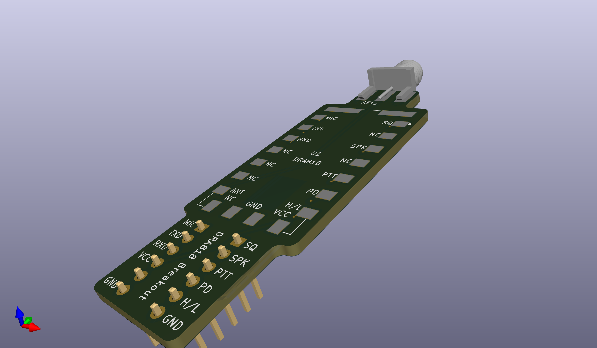

# DRA818 Breakout

This KiCad project is a breakout board for the DRA818 VHF/UHF transceiver
module. It's extremely simple and designed to be used on a breadboard. It does
incorporate an SMA antenna connector.

This fits the Dorji DRA818 module, both the UHF and VHF variants, and also the
pin-compatible NiceRF SA818 VHF and UHF modules.

